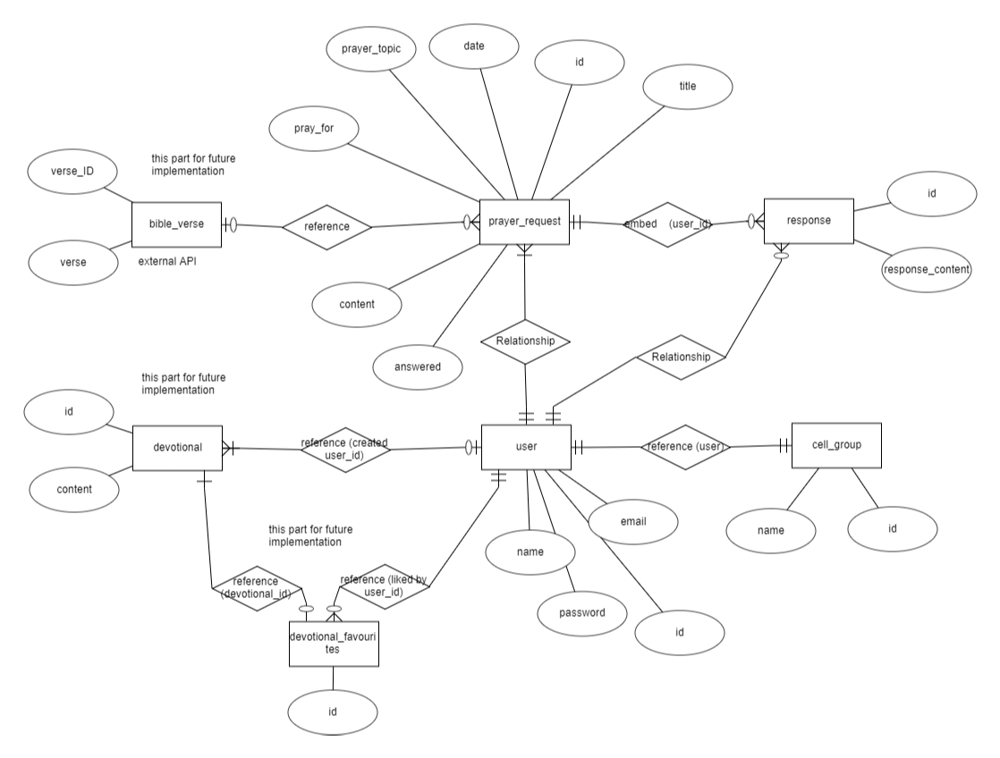
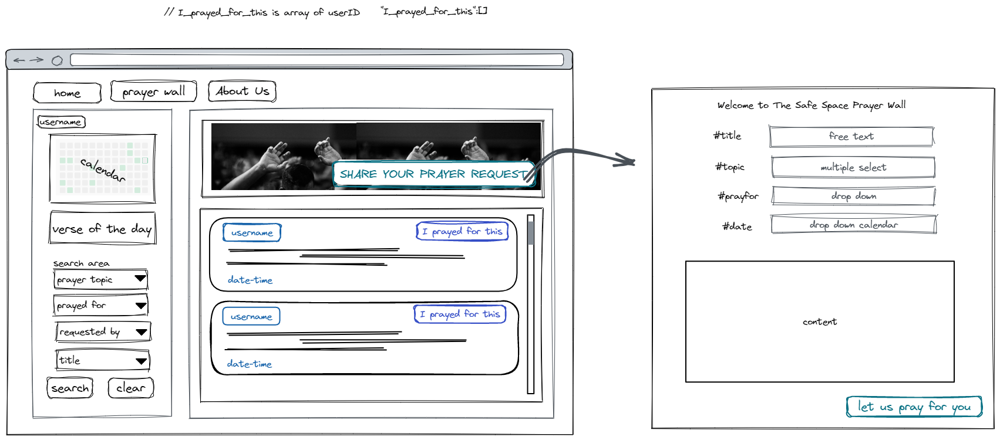
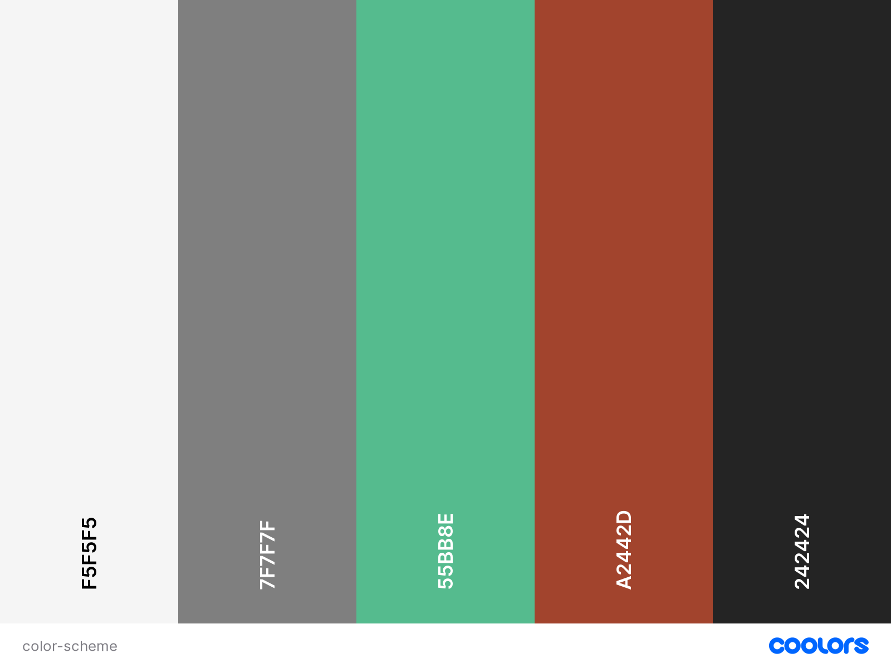

# **WALL OF PRAYS**

Link to demo : [WALL OF PRAYS](https://wall-of-prays.netlify.app/)

## Summary

WALL OF PRAYS is a safe and supportive platform for cellgroup and cell group members to share their prayer requests and receive uplifting responses from a community of like-minded individuals. By creating a user account, you can easily post your prayer requests and select the prayer topic and who you are praying for. Logged-in users can respond to requests and provide messages of support and hope. User's prayer requests and responses are only avalible to your cellgroupd members

Our website is designed to be user-friendly, with a simple and intuitive layout that makes it easy to post, edit, and manage your prayer requests. You can edit and delete your requests and responses at any time, and mark your requests as "answered" when God has answered your prayers.

## UI/UX

### Strategy

#### Organisational Goals

- To create a supportive and positive community where users can share their prayer requests and receive uplifting responses from others.
- To provide an easy-to-use platform where users can manage their prayer requests and responses.
- To foster a sense of belonging and connectedness among users by providing a safe and welcoming space for them to share their thoughts and feelings.
- To promote a culture of empathy and compassion among users by encouraging them to support and uplift one another.
- To establish the website as a trusted and respected resource for those seeking emotional and spiritual support.

#### User Goals

- To express their personal prayer requests and receive prayers and supportive messages from others in the community.
- To feel heard and understood by a community of like-minded individuals who share similar struggles and beliefs.
- To be able to manage their prayer requests and responses in a simple and intuitive way.
- To connect with others who share their faith and beliefs, and to feel a sense of belonging and connection.
- To find emotional and spiritual support during times of stress, hardship, and uncertainty.

| User Story                                                                                                                     | Acceptance Criteria                                                                                                                                                                                                                                                                   |
| ------------------------------------------------------------------------------------------------------------------------------ | ------------------------------------------------------------------------------------------------------------------------------------------------------------------------------------------------------------------------------------------------------------------------------------- |
| As a user, I want to create a new prayer request so that I can receive prayers and support from the community.                 | - I can create a new prayer request by filling out a form that includes the prayer topic and who I am praying for. - The request is saved and displayed on the Prayer Wall page.                                                                                                   |
| As a user, I want to edit my prayer request so that I can update it with new information.                                      | - I can edit prayer request created by me by clicking on the edit icon and eidt in the text box. - The request is saved and displayed on the Prayer Wall page.                                                                                                                     |
| As a user, I want to delete my prayer request so that I can remove it from the website.                                        | - I can click on the delete icon aboe my prayer request post. - Once clicked, it removes the prayer request and the response belongs to it from the website. - The request is no longer displayed on the Prayer Wall page.                                                      |
| As a user, I want to respond to a prayer request so that I can provide prayers and support to the person who made the request. | - I can click on the "response" button and write my response in the pop up form. - The response is saved and displayed on the Prayer Wall page below the prayer requesst and able to fold and expand.                                                                              |
| As a user, I want to edit my response to a prayer request so that I can update it with new information.                        | - I can click on an "edit" button next to my response that allows me to update my name or message of support. - The changes are saved and displayed on the Prayer Wall page.                                                                                                       |
| As a user, I want to delete my response to a prayer request so that I can remove it from the website.                          | - I can click on a "delete" button next to my response that removes the response from the website. - The response is no longer displayed on the Prayer Wall page.                                                                                                                  |
| As a user, I want to mark my prayer request as "answered" so that I can indicate that my prayers have been heard.              | - I can click on the heart shaped icon above my prayer request, on the popup alert, clicked on "answered" that changes the status of the request to "answered". - The request is displayed on the homepage and the request page with a label indicating that it has been answered. |
| As a user, I want to search and view the prayer requests and responses of other users so that I can offer prayers and support. | - On the side pannel I can search for prayer topic, prayed for , title, created by whom and created date after. - I can clear my search result by clicking on the clear button.                                                                                                    |

### Structure and Skeleton

#### Database

Entity-Relationship Diagram (ERD) is drawn to demostrate the various relationships between entities for the website prior to modelling the database in MongoDB.

An Express server is set up and deployed to [Render](https://render.com/), where API endpoints are accessible via the base URL at [https://ds-wallofprays.onrender.com].

#### Wireframes

### Design Decisions

#### Color scheme

The neutral shades of #F5F5F5 and #7F7F7F provide a clean and professional feel to the website, while the warmer tones of #55BB8E and #A2442D add a touch of vibrancy and energy.
The color #55BB8E, a shade of green, is associated with growth, renewal, and harmony, which are all relevant to the theme of prayer and spiritual well-being. Meanwhile, the color #A2442D, a shade of red, is associated with passion, energy, and urgency, which are also relevant to the theme of prayer requests and responses.
Overall, this color scheme is a good fit for the website as it creates a welcoming and calming atmosphere while still conveying a sense of urgency and importance for prayer requests and responses.

#### Fonts

_Gill Sans_ has a very distinctive look, with bold and upright letterforms, even stroke weights, and a geometric construction that gives it a modern and minimalist feel. It is known for its legibility and versatility, can also help create a sense of unity and coherence throughout the website, contribute to a sense of professionalism and reliability, which is important for users seeking spiritual guidance and support.

## Features

## Features

| Feature                             | Description                                                                                                                                          |
| ----------------------------------- | ---------------------------------------------------------------------------------------------------------------------------------------------------- |
| User Login/ Signup                  | Allows users to create and log into their personal accounts, ensuring their prayer requests and responses to be only visible by their own cellgroup. |
| Prayer Request Creation             | Enables users to create and post their prayer requests, including choosing a prayer request topic and specifying who they are praying for.           |
| Prayer Request Editing and Deletion | Allows users to edit or delete their prayer requests as needed, ensuring that their requests remain up-to-date and relevant.                         |
| Response Creation                   | Enables users to respond to other users' prayer requests, providing support and encouragement to those in need.                                      |
| Response Editing and Deletion       | Allows users to edit or delete their responses as needed, ensuring that their responses remain appropriate and respectful.                           |
| Prayer Request Status               | Enables users to change the status of their prayer requests, indicating whether they have been answered or are still ongoing.                        |
| Prayer Request Search               | Enables users to search prayer requests by created by, prayer topic, prayed for, title and created after date.                                       |

## Limitations and Future Implementations

As of now, the website does not have proper security measures in place for user information and user login. In order to ensure the safety and privacy of our users, this feature will be implemented in future updates.

Additionally, there are several potential future implementations for the website, including:

- Implementing a notification system to alert users when their prayer requests have been responded to or when someone has commented on their request.
- Enable user to create their own more diverse and specific prayer request topics to better cater to users' needs and preferences.
- Implementing verse of the day by connecting to an extenal bible api
- Implementing posting prayer request anonymously.
- Improve on the clear search result feature.

## Technologies Used

### Backend

1. Javascript

2. [Express](https://expressjs.com/)

3. [MongoDB Node Driver](https://www.mongodb.com/docs/drivers/node/current/)

   - To communicate with MongoDB database

4. [cors](https://www.npmjs.com/package/cors)

   - Middleware to enable Cross-Origin Resource Sharing (CORS)

5. [dotenv](https://www.npmjs.com/package/dotenv)

   - To allow loading of environment variables from .env file

### Frontend

1. HTML

2. CSS

3. Javascript

4. [React](https://reactjs.org/)

5. [Bootstrap 5](https://getbootstrap.com/docs/5.0/getting-started/introduction/)

   - Used for styling website

6. [React Bootstrap](https://react-bootstrap.github.io/)

   - Used for styling website

7. [Axios](https://github.com/axios/axios)

   - Used to communicate with Express server to create, read, update and delete data in database

8. [Google Fonts](https://fonts.google.com/)

   - Used for fonts displayed in website

9. [Sweetalert2](https://sweetalert2.github.io/)

   - Used for pop up form and alert displayed in website

10. [React Icons](https://react-icons.github.io/react-icons)

    - Used for icons displayed in website

11. [React calendar](https://www.npmjs.com/package/react-calenda)

    - Used for calendar displayed in website

12. [React datepicker](https://www.npmjs.com/package/react-datepicker)

    - Used for datepicker displayed in website

---

## Deployment

### Frontend

The website is hosted using [Netlify](https://www.netlify.com/), deployed directly from the main branch of this Github repository.
For the detailed deployment steps, you can refer to the blog post on Netlify [here](https://www.netlify.com/blog/2016/09/29/a-step-by-step-guide-deploying-on-netlify/).

### Backend

The Express server is hosted using [Render](https://render.com/), deployed directly from the main branch of the Github repository [here](https://github.com/DS-NASA-61/dwad-22-project-2-api).
For the detailed deployment steps, you can refer to the documentation on Heroku [here](https://render.com/docs).

---

## Credits and Acknowledgement

### Logo :

- [Canva](https://www.canva.cn/) - Used to generate brand logo for website

### Fonts :

- [Google Fonts](https://fonts.google.com/) - Used for fonts displayed in website

### Icons :

- [React Icons](https://react-icons.github.io/react-icons) - Used for icons displayed in website

### Regular Expressions

- [w3resource](https://www.w3resource.com/javascript/form/email-validation.php) - Used Regex for email validation

### Images :

- [Unsplash](https://unsplash.com/) - For images used in website

### Screenshot :

- [Website Mockup Generator](https://websitemockupgenerator.com/) - Used to generate responsive website mockup for README file
